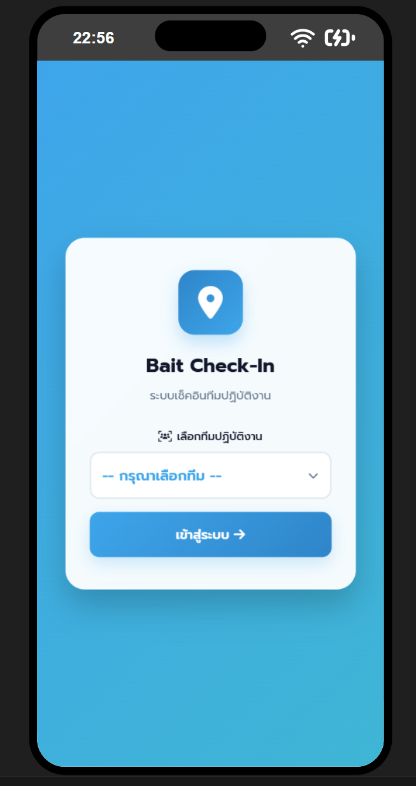
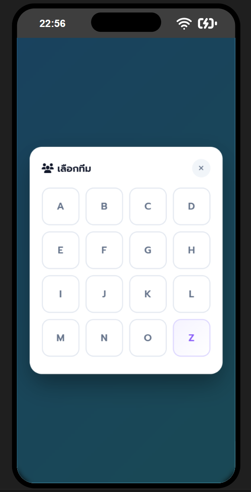

# 📍 Bait Team Check-in

> **🇹🇭 ภาษาไทย | 🇬🇧 English**

---

## 🇹🇭 ภาษาไทย

### เกี่ยวกับโปรเจกต์

**Bait Team Check-in** เป็นเว็บแอปพลิเคชันสำหรับเช็คอินและติดตามตำแหน่งการทำงานของทีมงานภาคสนาม พัฒนาขึ้นเพื่อใช้งานภายในบริษัทกำจัดแมลง

**🌐 Live URL:** [https://bait-check-in-webapp.web.app](https://bait-check-in-webapp.web.app)

### วัตถุประสงค์

- **ติดตามการทำงาน**: ให้ทีมสนับสนุน (Back Office) เห็นเส้นทางและตำแหน่งการทำงานของพนักงานแบบ Real-time
- **วางแผนเส้นทาง**: ใช้ข้อมูลในการวิเคราะห์และวางแผนเส้นทางการทำงานในอนาคต
- **บันทึกหลักฐาน**: ถ่ายรูปและบันทึกข้อมูลหน้างานเพื่อใช้อ้างอิง

### เบื้องหลังการพัฒนา

โปรเจกต์นี้พัฒนาด้วยแนวคิด **Vibe Coding** — การเขียนโค้ดโดยมี AI เป็นผู้ช่วย โดยผู้พัฒนาเป็น **นักกีฏวิทยา (Entomologist)** ในบริษัทกำจัดแมลง ไม่ใช่โปรแกรมเมอร์โดยอาชีพ จัดทำขึ้นเพื่อ:

- ฝึกฝนการสร้าง Web Application
- แก้ปัญหาจริงในการทำงาน
- เรียนรู้เทคโนโลยีใหม่ๆ

### 📢 ข้อเสนอแนะ

หากมีคำแนะนำหรือข้อเสนอแนะ ยินดีรับฟังผ่าน **Issues** หรือ **Discussions** ได้เลยครับ!

---

## 🇬🇧 English

### About

**Bait Team Check-in** is a web application for check-in and location tracking of field service teams. Developed for internal use at a pest control company.

**🌐 Live URL:** [https://bait-check-in-webapp.web.app](https://bait-check-in-webapp.web.app)

### Purpose

- **Work Tracking**: Enable back-office teams to view real-time routes and locations of field workers
- **Route Planning**: Use collected data to analyze and plan future work routes
- **Evidence Recording**: Capture photos and job site data for reference

### Development Background

This project was developed using **Vibe Coding** — coding with AI assistance. The developer is an **Entomologist** working at a pest control company, not a professional programmer. It was created to:

- Practice building web applications
- Solve real workplace problems
- Learn new technologies

### 📢 Feedback

Suggestions and feedback are welcome! Please feel free to open an **Issue** or start a **Discussion**.

---

## 📸 Screenshots

### 📱 Mobile Check-in

| หน้าหลัก | เลือกทีม | ฟอร์มเช็คอิน |
|:--------:|:------------:|:-------:|
|  |  |  |

### 🖥️ Admin Dashboard

| Dashboard Overview | แผนที่ |
|:------------------:|:------:|
|  |  |

| ตารางข้อมูล | Photo Gallery |
|:-----------:|:-------------:|
|  |  |

---

## 🚀 Features / คุณสมบัติหลัก

### 📱 Mobile (Field Team)

| Feature | Description |
|---------|-------------|
| GPS Check-in | ระบุพิกัด GPS พร้อมแปลงเป็นที่อยู่อัตโนมัติ |
| Photo Capture | ถ่ายรูปหน้างานพร้อมบีบอัดไฟล์ (120-450 KB) |
| Team Selection | รองรับ 16 ทีม (A-O, Z) |
| History View | ดูรายการเช็คอินย้อนหลัง |
| Visibility Toggle | ซ่อน/แสดงหมุดบนแผนที่ |

### 🖥️ Desktop (Admin Dashboard)

| Feature | Description |
|---------|-------------|
| Real-time Dashboard | ดูสถิติและภาพรวมแบบ Real-time |
| Interactive Map | แสดงตำแหน่งทีมงาน พร้อมหมุดสีตามทีม |
| Distance Measurement | วัดระยะหลายจุด + วงกลมรัศมี |
| Data Table | Sort, Filter, ซ่อน/แสดงหมุด |
| Export | ส่งออกเป็น Excel/CSV |
| Photo Gallery | ดูรูปภาพทั้งหมด |

---

## 🛠 Tech Stack / เทคโนโลยี

| Layer | Technology |
|-------|------------|
| **Frontend** | HTML5, CSS3, Vanilla JavaScript |
| **Map** | Leaflet.js + OpenStreetMap |
| **Geocoding** | Longdo Map API |
| **Icons** | Font Awesome 6 |
| **Font** | Google Fonts (Prompt) |
| **Database** | Firebase Firestore |
| **Storage** | Firebase Cloud Storage |
| **Hosting** | Firebase Hosting |
| **Testing** | Playwright E2E |

---

## 📊 Project Status / สถานะโปรเจกต์

| Category | Status |
|----------|--------|
| Frontend Mobile | ✅ 100% |
| Frontend Dashboard | ✅ 100% |
| Backend (Firebase) | ✅ 100% |
| Testing (Playwright) | ✅ 100% |
| Documentation | ✅ 100% |
| **Overall** | ✅ **Production Ready** |

---

## 📁 Project Structure / โครงสร้างโปรเจกต์

```
Bait-Team-Check-in/
├── index.html              # Landing page (auto-redirect)
├── mobile-checkin.html     # Mobile check-in page
├── admin-dashboard.html    # Admin dashboard
├── firebase.json           # Firebase configuration
├── playwright.config.js    # Test configuration
│
├── docs/                   # Documentation
├── firebase/               # Security rules
├── src/                    # Config files
├── image/                  # Screenshots & assets
└── tests/                  # Playwright tests
```

---

## 🚀 Quick Start / เริ่มต้นใช้งาน

### Prerequisites

- Node.js 18+
- Firebase CLI
- Modern browser

### Installation

```bash
# Clone repository
git clone https://github.com/13azukaoab/Bait-Team-Check-in.git
cd Bait-Team-Check-in

# Install dependencies
npm install

# Copy config template
cp src/config.example.js src/config.js
# Edit src/config.js with your API keys

# Start local server
npx http-server -p 8080
```

### Deploy

```powershell
# Deploy to Firebase
.\deploy.ps1
# or
firebase deploy --only hosting
```

---

## 📖 Documentation / เอกสาร

| Document | Description |
|----------|-------------|
| [User Guide](docs/user-guide.md) | คู่มือการใช้งาน |
| [Installation Guide](docs/installation-guide.md) | คู่มือการติดตั้ง |
| [Flowchart](docs/webapp-flowchart.drawio) | แผนภาพการทำงาน |

---

## 🧪 Testing

```powershell
# Run all tests
.\test.ps1

# With browser visible
.\test.ps1 -Headed

# View report
.\test.ps1 -Report
```

---

## 🙏 Acknowledgments / ขอบคุณ

โปรเจกต์นี้สำเร็จได้ด้วยความช่วยเหลือจาก AI Tools:

| AI Tool | Usage |
|---------|-------|
| **GitHub Copilot** | Code completion, debugging, refactoring |
| **Claude (Anthropic)** | Architecture design, problem-solving, documentation |
| **ChatGPT (OpenAI)** | Research, learning, code review |

> 💡 **Vibe Coding** — เมื่อ AI เป็นผู้ช่วย ทุกคนสามารถสร้างสิ่งที่ต้องการได้

---

## 📜 License

This project is for educational and internal use.

---

## 👤 Author / ผู้พัฒนา

**Weerachon** — Entomologist & Vibe Coder 🐛💻

*นักกีฏวิทยาที่หลงรักการเขียนโค้ด*

---

**Version:** 2.2.5  
**Last Updated:** 05-02-2026
